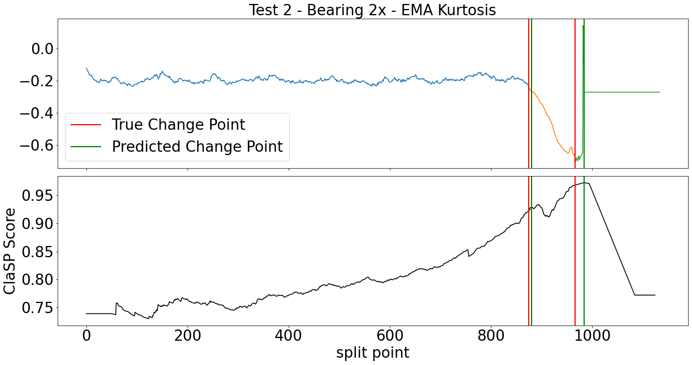

# Early Detection of Bearing Degradation
*Early detection of bearing degradation using IMS vibration signal data and unsupervised time series segmentation.*

This is my capstone project as part of the **Spring 2024 Applied Analytics Practicum (MGT 6748)** at [**Georgia Tech Online Master’s in Analytics**](https://pe.gatech.edu/degrees/analytics).  The project sponsor was Sandia National Labs, who tasked students with building a signal classifier to parse "healthy" from "faulty" signal.

**Author**: Nadav Rindler (nrindler3)

### Abstract
Prognostics is an engineering discipline that applies data science and machine learning techniques to predict when part or machine maintenance is needed before fault or failure occurs.  These techniques can be applied to bearings, a critical machine component with wide industrial applications.  Bearing vibration signal can be measured using accelerometer sensors to determine states of deterioration and failure.  Until now, most research has focused on labeling bearing status as functional or failed, a binary classification problem.  Using multi-class classification techniques, it may be possible to detect early stages of bearing fault before failure occurs.  

First, I define three bearing life stages – healthy, faulty, and failed – and identify two time series measures from the literature that are predictive of failure. I then discuss an attempt to apply a semi-supervised learning approach developed by [Juodelyte, et. al.](https://arxiv.org/abs/2203.03259) to new bearing data from three run-to-failure experiments published by the Center for Intelligent Maintenance Systems (IMS) in 2007 and accessed via the open-source [NASA Prognostics Data Repository](https://www.nasa.gov/intelligent-systems-division/discovery-and-systems-health/pcoe/pcoe-data-set-repository/).  Finally, I identified a new unsupervised time series segmentation approach to detect phase change from the healthy to faulty states, allowing early detection before failure occurs.  This approach detects meaningful change in the bearing’s signal, on average 85% of the way through the bearing’s lifetime, and with sensitivity of 50% and specificity of 83%.  This approach is simple, reliable, and automatable. This analysis shows that early detection of bearing degradation is possible and has implications for improved predictive maintenance.

### Full Text
See the [**final report**](Rindler%20-%20SP24%20Analytics%20Practicum%20-%20Final%20Report%20-%20Sandia%20Labs.pdf) and accompanying [**slide deck**](Rindler%20-%20SP24%20Analytics%20Practicum%20-%20Final%20Presentation%20-%20Sandia%20Labs.pdf).

*Sample result from Time Series Segmentation analysis: TSS predicted change points close to actual change points identified by manual labeling.*

### How to navigate this project
**[Data](Data/IMS)**  
Bearing data are from three run-to-failure experiments published by the Center for Intelligent Maintenance Systems (IMS) in 2007 and are accessible from the open-source [NASA Prognostics Data Repository](https://www.nasa.gov/intelligent-systems-division/discovery-and-systems-health/pcoe/pcoe-data-set-repository/).  Sample raw data, intermediate datasets, outputs, and the folder structure used in the analysis are provided in [Data/IMS/](Data/IMS) to facilitate replication.

**Notebooks**
1. **[Read_and_Sample_Data](Read_and_Sample_Data.ipynb)** - creates functions to ingest and down-sample data from the three run-to-failure bearing experiments. Functions are saved to "Read_and_Sample_Data.py" to be imported in subsequent notebooks.
2. **[Data_Transforms](Data_Transforms.ipynb)** - creates functions to extract frequency-domain features via Fast Fourier Transform and calculate time-domain features via 22 measures of the signal data (absolute mean, RMS, kurtosis, etc.). Functions are saved to "Data_Transforms.py" to be imported in subsequent notebooks.
3. **[Extract_Freq_and_Time_Series_Features](Extract_Freq_and_Time_Series_Features.ipynb)** - reads data from the three experiments using functions from "Read_and_Sample_Data.py", extracts frequency- and time-domain features using functions from "Data_Transforms.py", and saves down the resulting frequency and time series data to CSV files, outputting two files per each of the 12 bearings in the IMS dataset.
4. **Exploratory Data Analysis** ([EDA-Test1](EDA-Test1.ipynb), [EDA-Test2](EDA-Test2.ipynb), and [EDA-Test3](EDA-Test3.ipynb)) - show exploratory data analysis on each of the three experiments (each experiment included 4 bearings). The EDA evaluates various time series measures for predictive value in creating manual labels to classify bearings into healthy, faulty, and failed states.
5. **[Implement_ITUC_AutoEncoder_kMeans](Implement_ITUC_AutoEncoder_kMeans.ipynb)** - trains an unsupervised AutoEncoder and k-means clustering algorithms on bearing frequency-domain data. Replicates the methodology developed by [Juhodelyte, et. al. (2022)](https://dl.acm.org/doi/10.1145/3534678.3539057) and accessed from their [GitHub repository](https://github.com/DovileDo/BearingDegradationStageDetection) under the MIT license.
6. **[Manual_Labeling](Manual_Labeling.ipynb)** - develops a manual labeling methodology based on two time-domain metrics: the exponential moving average of kurtosis (identified by [Sutrisno, Oh, et. al. (2012)](https://ieeexplore.ieee.org/document/6299548)) and smoothed maximum acceleration (identified by [Sahoo and Mohanty (2022)](https://link.springer.com/chapter/10.1007/978-3-030-93639-6_35).
7. **[TS_Segmentation](TS_Segmentation.ipynb)** - implements unsupervised time series segmentation (TSS) for change detection, to identify stages of bearing degradation. Uses the Classification Score Profile (ClaSP) algorithm developed by [Ermshaus, et. al. 2023](https://link.springer.com/article/10.1007/s10618-023-00923-x) and available as the [ClaSPy](https://github.com/ermshaua/claspy/tree/main) Python package.

TSS output charts and predicted change points are outputted to [Data/IMS/figures/](Data/IMS/figures) and [results.csv](Data/IMS/results.csv). Results summary table [here](Results_Summary.xlsx).
